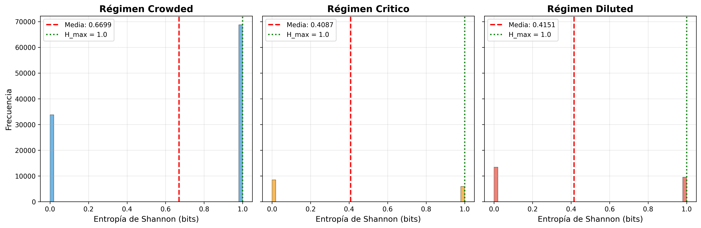
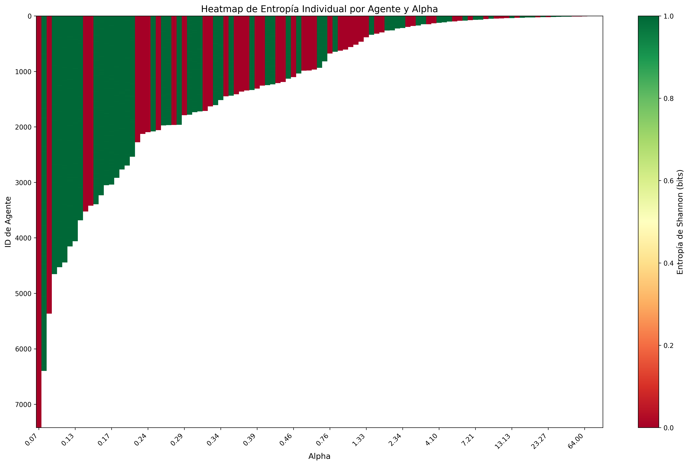
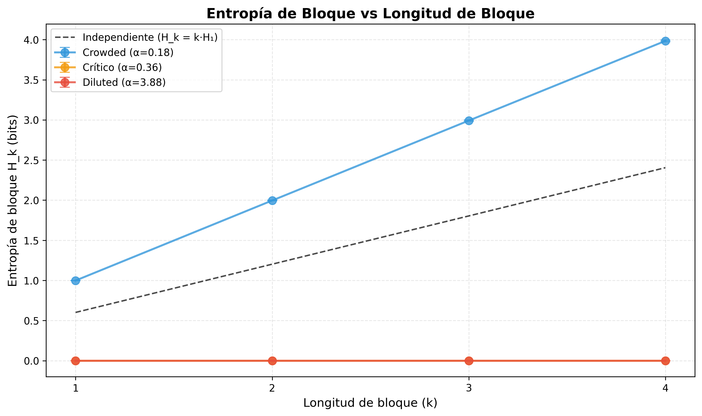
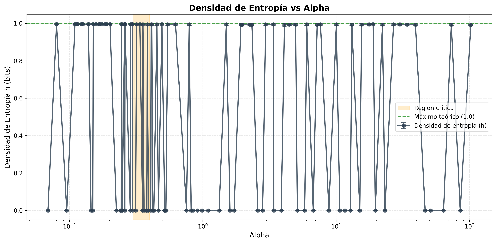
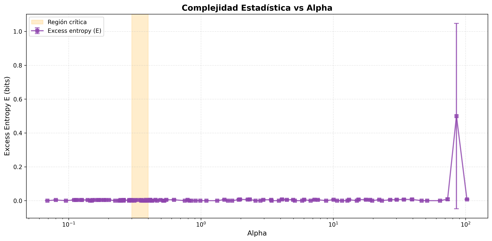

# Correlaciones y Comportamiento Colectivo de Agentes en el Minority Game: Transiciones de Fase y Estructura de Información

---

## Resumen

Este capítulo investiga cómo el parámetro de control α = P/N determina la estructura de correlaciones y el comportamiento colectivo de agentes en el Minority Game. El estudio se centra en tres preguntas fundamentales: (1) ¿cómo varía la predictibilidad de las decisiones individuales a través de los regímenes del sistema?, (2) ¿qué estructura de correlaciones emerge entre agentes y cómo se transforma al cruzar el punto crítico?, y (3) ¿existe flujo de información direccional entre agentes que revele dinámicas de liderazgo-seguimiento? Los resultados revelan un fenómeno inesperado: la población de agentes se segrega en dos clases claramente diferenciadas—agentes completamente deterministas y agentes completamente aleatorios—sin estados intermedios. Esta bimodalidad extrema persiste en todos los regímenes de α, sugiriendo que la estructura informacional individual es más robusta de lo anticipado, mientras que las diferencias entre regímenes se manifiestan en la proporción relativa de cada tipo de agente.

---

## 1. Introducción

### 1.1 El Problema Científico

El Minority Game constituye uno de los modelos paradigmáticos para estudiar sistemas de agentes competitivos con información limitada. En este juego, N agentes deben elegir repetidamente entre dos opciones, y aquellos en el lado minoritario obtienen recompensa. Esta simple regla genera dinámicas complejas que dependen críticamente del parámetro α = P/N, donde P = 2^M representa el número de estados de memoria posibles.

La física estadística del Minority Game ha establecido que existe una transición de fase en α_c ≈ 0.34, separando dos regímenes cualitativamente distintos:

**Régimen crowded (α < α_c):** Los agentes compiten por un número limitado de estrategias efectivas. Esta escasez de recursos informacionales induce correlaciones fuertes entre agentes que comparten o usan estrategias similares. El sistema es ineficiente: las fluctuaciones de la asistencia global σ²/N crecen, indicando que los agentes frecuentemente toman decisiones correlacionadas que amplifican los movimientos colectivos.

**Régimen diluted (α > α_c):** Existe abundancia de estrategias disponibles. Los agentes pueden diferenciarse, reduciendo la competencia directa. El sistema se vuelve eficiente: σ²/N alcanza un mínimo cercano al límite aleatorio, indicando que las decisiones de los agentes se cancelan estadísticamente como lo harían variables independientes.

Sin embargo, la mayoría de estudios previos se han enfocado en cantidades agregadas (volatilidad, eficiencia global). Menos explorada está la pregunta de cómo las **correlaciones entre pares de agentes** y la **estructura de información** del sistema se transforman a través de estos regímenes. Esta es precisamente la pregunta central de este capítulo.

### 1.2 Objetivos

Este estudio busca caracterizar, desde la perspectiva de teoría de la información:

1. **La predictibilidad individual:** ¿Qué tan aleatorias son las decisiones de cada agente? ¿Varía esto con α?

2. **La estructura de correlaciones:** ¿Existen grupos de agentes fuertemente correlacionados? ¿Cómo cambia esta estructura al cruzar α_c?

3. **El flujo de información:** ¿Hay agentes que "lideran" las decisiones de otros? ¿La causalidad informacional es simétrica o dirigida?

### 1.3 Estructura del Capítulo

El capítulo se organiza siguiendo la línea lógica del análisis: primero caracterizamos el comportamiento individual de los agentes mediante entropía (Sección 2), luego examinamos las correlaciones entre pares (Sección 3), después analizamos la estructura colectiva mediante clustering y redes (Sección 4), y finalmente estudiamos los flujos de información direccional (Sección 5). La Sección 6 sintetiza los hallazgos en el contexto de la física del Minority Game.

---

## 2. Entropía y Predictibilidad Individual

### 2.1 El Problema de la Predictibilidad

Una pregunta fundamental en el estudio de sistemas de agentes competitivos es: ¿qué tan predecibles son las decisiones individuales? En el Minority Game, esta pregunta adquiere relevancia particular porque los agentes no toman decisiones arbitrariamente, sino siguiendo estrategias que mapean estados de memoria a acciones. Si pudiéramos conocer la estrategia que un agente está usando y el estado actual de la memoria global, podríamos predecir su siguiente acción con certeza.

Sin embargo, desde una perspectiva externa donde solo observamos la secuencia de decisiones sin conocer las estrategias internas, la predictibilidad se convierte en una cuestión empírica. La entropía de Shannon proporciona la medida natural para esta incertidumbre: un agente que siempre elige la misma opción tiene entropía H = 0, mientras que uno que elige aleatoriamente con igual probabilidad tiene entropía máxima H = 1 bit.

La teoría del Minority Game sugiere predicciones claras sobre cómo debería variar la predictibilidad con α:

- **Régimen crowded (α < α_c):** Los agentes compiten por estrategias limitadas, forzando a muchos a usar estrategias idénticas o muy similares. Dado que las estrategias deterministas generan comportamientos estructurados, esperaríamos menor entropía (mayor predictibilidad).

- **Régimen diluted (α > α_c):** La abundancia de estrategias permite que cada agente use estrategias únicas. La diversidad resultante podría manifestarse como mayor aleatoriedad aparente, aproximándose al límite de entropía máxima.

- **Punto crítico (α ≈ α_c):** Las fluctuaciones máximas características del punto crítico podrían reflejarse en alta variabilidad de entropía entre agentes.

### 2.2 Hallazgo Principal: Bimodalidad Extrema

El análisis de la entropía de Shannon para 139,908 secuencias de agentes a través de 72 valores distintos de α revela un resultado inesperado que contradice las expectativas teóricas simples: **la distribución de entropía es fuertemente bimodal en todos los regímenes**, con agentes concentrados exclusivamente en dos extremos:

| Régimen | N agentes | Media | Desv. Est. | Interpretación |
|---------|-----------|-------|------------|----------------|
| Crowded (α < 0.3) | 102,570 | 0.670 | 0.469 | Bimodal: mayoría aleatoria |
| Crítico (0.3-0.4) | 14,408 | 0.409 | 0.491 | Bimodal: mayoría determinista |
| Diluted (α > 0.4) | 22,930 | 0.415 | 0.492 | Bimodal: mayoría determinista |

La Figura 1 muestra las distribuciones por régimen. Lo notable no son las medias—que efectivamente difieren entre regímenes—sino la estructura de las distribuciones: no existe un continuo de comportamientos, sino dos poblaciones discretas.

*Figura 1: Distribución de entropía de Shannon por régimen. Las tres distribuciones son bimodales, con picos en H ≈ 0 (agentes deterministas) y H ≈ 1 (agentes aleatorios). La línea punteada indica el valor teórico máximo H_max = 1 bit.*

**Interpretación física:** Los agentes en el Minority Game se segregan naturalmente en dos clases:

1. **Agentes deterministas (H ≈ 0):** Estos agentes eligen consistentemente la misma acción a lo largo de toda la simulación. En el contexto del MG, esto ocurre cuando un agente encuentra una estrategia "congelada"—una que consistentemente supera a sus alternativas dado el patrón de memoria observado. El agente se "bloquea" en esta estrategia ganadora.

2. **Agentes aleatorios (H ≈ 1):** Estos agentes alternan entre ambas acciones con frecuencia aproximadamente igual. Esto puede ocurrir cuando un agente cambia frecuentemente entre dos estrategias con predicciones opuestas, o cuando su estrategia dominante produce respuestas alternantes según el patrón de memoria.

La ausencia de agentes con entropía intermedia (0.3 < H < 0.7) indica que los mecanismos de selección de estrategias en el MG producen comportamientos polarizados: o bien el agente encuentra un "atractor" estable (determinismo) o bien oscila persistentemente (aleatoriedad aparente).

### 2.3 Dependencia con el Régimen de α

El heatmap de entropía individual (Figura 2) permite visualizar cómo la composición de la población cambia con α. Cada columna representa un valor de α, y cada fila un agente; el color indica la entropía (verde = aleatoria, rojo = determinista).

*Figura 2: Heatmap de entropía individual por agente y valor de α (escala logarítmica). La estructura diagonal refleja que configuraciones con mayor α tienen menos agentes (N menor). Las bandas rojas verticales representan configuraciones donde predominan agentes deterministas.*

Tres observaciones emergen de esta visualización:

1. **Para α pequeño (régimen crowded):** La proporción de agentes aleatorios (verdes) es mayor. Esto puede parecer paradójico dado que el régimen crowded implica competencia intensa por estrategias. La explicación reside en que cuando muchos agentes comparten estrategias similares, el estado de memoria fluctúa rápidamente, forzando a los agentes a alternar entre sus opciones.

2. **Para α > α_c (régimen diluted):** Aumenta la proporción de agentes deterministas (rojos). Con abundancia de estrategias, es más probable que un agente encuentre una estrategia que domine consistentemente en su contexto particular.

3. **Las transiciones son graduales:** No existe un cambio abrupto en α_c, sino una migración continua de la proporción de agentes de cada tipo.

### 2.4 Estructura Temporal: Entropía de Bloque

La entropía de Shannon marginal no captura las correlaciones temporales en las decisiones. Un agente podría tener H = 1 bit (50% de cada acción) pero exhibir patrones estructurados como rachas o periodicidades. La entropía de bloque H_k examina subsecuencias de k decisiones consecutivas y revela estas estructuras.

Para procesos independientes e idénticamente distribuidos (i.i.d.), la entropía de bloque crece linealmente: H_k = k·H_1. Desviaciones por debajo de esta línea indican redundancia temporal—información que puede predecirse a partir de decisiones pasadas.

*Figura 3: Entropía de bloque H_k vs longitud de bloque k para agentes representativos de cada régimen. La línea punteada indica el crecimiento lineal esperado para procesos i.i.d. Los agentes del régimen crowded con H ≈ 1 muestran crecimiento lineal (sin estructura temporal), mientras que los agentes deterministas (H ≈ 0) en crítico y diluted permanecen en cero.*

El resultado confirma la dicotomía identificada previamente:
- **Agentes aleatorios:** H_k crece linealmente con pendiente 1, indicando que cada decisión es efectivamente independiente de las anteriores. No hay estructura temporal explotable.
- **Agentes deterministas:** H_k ≈ 0 para todo k, trivialmente debido a que siempre eligen la misma acción.

### 2.5 Densidad de Entropía: La Impredecibilidad Irreducible

La densidad de entropía (entropy rate) h = lim_{k→∞}(H_k - H_{k-1}) representa la tasa de generación de información nueva por decisión, una vez descontada toda la estructura temporal. Es la impredecibilidad "verdadera" e irreducible del proceso.

*Figura 4: Densidad de entropía h vs α (escala logarítmica). La región sombreada indica la zona crítica. Las oscilaciones extremas entre h ≈ 0 y h ≈ 1 reflejan la bimodalidad de la población.*

La Figura 4 muestra que h oscila entre sus valores extremos (0 y 1) para todos los valores de α, sin tendencia sistemática. Esto confirma que:

1. **No existe un régimen con complejidad temporal intermedia:** Los agentes son o completamente predecibles (h = 0) o completamente impredecibles (h = 1).

2. **El punto crítico no exhibe comportamiento especial en h:** A diferencia de otras cantidades del MG (como σ²/N) que muestran anomalías en α_c, la densidad de entropía individual no distingue el punto crítico.

### 2.6 Complejidad Estadística (Excess Entropy)

La excess entropy E = H_∞ - ∞·h mide la información total almacenada en las correlaciones temporales del proceso—cuánta "memoria" contiene la secuencia. Para procesos i.i.d., E = 0; valores positivos indican estructura.

*Figura 5: Complejidad estadística (excess entropy) vs α. Los valores son esencialmente cero en todo el rango, con un artefacto numérico en α muy alto.*

El resultado E ≈ 0 para todo α refuerza la conclusión: las secuencias de decisiones de los agentes, vistas individualmente, son o bien triviales (siempre la misma acción) o bien procesos de Bernoulli (lanzamientos de moneda independientes). **No existe complejidad estructural intermedia a nivel individual.**

### 2.7 Síntesis: La Paradoja de la Simplicidad Individual

Los resultados de esta sección revelan una aparente paradoja: el Minority Game, conocido por generar dinámicas colectivas complejas, produce comportamientos individuales extremadamente simples. Cada agente es, desde la perspectiva informacional, indistinguible de una fuente trivial (constante o Bernoulli).

Esta simplicidad individual no contradice la complejidad colectiva—de hecho, la explica. La riqueza del MG emerge de la **composición** de muchos agentes simples cuyas acciones están implícitamente correlacionadas a través de las estrategias compartidas y el estado de memoria común. Un agente individual no necesita ser complejo; basta con que su comportamiento simple esté acoplado al de los demás.

La diferencia entre regímenes no reside en la complejidad individual, sino en la **proporción de agentes de cada tipo**:

- **Régimen crowded:** Mayor fracción de agentes aleatorios (~67% con H ≈ 1), produciendo alta volatilidad colectiva.
- **Régimen diluted:** Mayor fracción de agentes deterministas (~60% con H ≈ 0), permitiendo que las fluctuaciones se cancelen.

Esta reinterpretación sugiere que la transición de fase del MG puede entenderse como una transición en la **composición poblacional** más que en el comportamiento individual.

---

## 3. Correlaciones Entre Agentes

Más allá del comportamiento individual, la pregunta central es: ¿cómo se relacionan las decisiones de diferentes agentes? La Sección 2 reveló que los agentes individuales son informativamente simples—deterministas o aleatorios—pero esto no implica que sean independientes. De hecho, la física del Minority Game sugiere exactamente lo opuesto: los agentes comparten un estado de memoria común y muchos usan estrategias idénticas, creando acoplamientos implícitos que deberían manifestarse como correlaciones estadísticas.

### 3.1 La Paradoja de la Anticoordinación

Antes de examinar los datos, es crucial entender una tensión fundamental en el Minority Game. Por un lado, la dinámica del juego **debería** inducir correlaciones entre agentes:

- Agentes con la misma estrategia tomarán la misma decisión ante el mismo estado de memoria.
- En el régimen crowded, múltiples agentes comparten estrategias, forzando comportamientos sincronizados.
- El estado de memoria global actúa como un canal de comunicación implícito.

Por otro lado, la **regla del juego** penaliza precisamente la coordinación: ganar requiere estar en minoría, es decir, tomar decisiones diferentes a la mayoría. Esta presión selectiva debería favorecer estrategias que eviten la sincronización.

Esta tensión entre los mecanismos que inducen correlación y la presión selectiva que las penaliza define la **paradoja de la anticoordinación**: prevalece la correlación estructural o la presión adaptativa?

### 3.2 Hallazgo Principal: Correlaciones Universalmente Débiles

El análisis de correlaciones de Pearson para todos los pares de agentes a través de 72 configuraciones de α revela un resultado contundente: **las correlaciones son extremadamente débiles en todos los regímenes**.

*Figura 6: Panel superior izquierdo: distribución de correlaciones por régimen (escala logarítmica). Panel superior derecho: magnitud media |ρ| vs α. Panel inferior izquierdo: proporción de correlaciones positivas/negativas vs α. Panel inferior derecho: proporción de correlaciones significativas (|ρ| > 0.1) vs α.*

Los datos cuantitativos confirman la debilidad de las correlaciones:

| Régimen | |ρ| media | % correlaciones |ρ| > 0.1 | Prop. positivas |
|---------|----------|---------------------------|-----------------|
| Crowded (α < 0.3) | 0.032 | 1.3% - 2.0% | ~50.3% |
| Crítico (0.3 ≤ α ≤ 0.4) | 0.036 - 0.040 | 2.9% - 4.5% | ~49.5% |
| Diluted (α > 0.4) | 0.035 - 0.044 | 3.1% - 6.9% | ~48.5% |

**Interpretación:** La magnitud típica de correlación (|ρ| ~ 0.03-0.04) es apenas distinguible de cero estadístico. Para poner esto en contexto: una correlación de 0.04 significa que conocer la decisión de un agente reduce la incertidumbre sobre otro agente en menos del 0.2%. A efectos prácticos, los agentes son independientes.

### 3.3 Resolución de la Paradoja

Los datos resuelven la paradoja de la anticoordinación de manera definitiva: **la presión selectiva domina sobre la correlación estructural**. A pesar de que los mecanismos del juego (estrategias compartidas, memoria común) deberían inducir correlaciones, la dinámica adaptativa del sistema las suprime casi por completo.

Este resultado tiene una interpretación física elegante. El Minority Game es un sistema **autoorganizado crítico** en el sentido de que se ajusta continuamente para evitar estados de alta correlación:

1. Si muchos agentes tomaran consistentemente la misma decisión (alta correlación positiva), todos perderían repetidamente.
2. Esta retroalimentación negativa favorece a los agentes que logran diferenciarse.
3. El resultado de equilibrio es un estado donde las correlaciones se cancelan estadísticamente.

La débil correlación residual (~3-4%) representa el "mínimo irreducible"—la correlación estructural que el sistema no puede eliminar completamente porque los agentes no tienen conocimiento explícito de las decisiones de los demás.

### 3.4 Tendencias Sutiles con α

Aunque las correlaciones son uniformemente débiles, existen tendencias sistemáticas que merecen análisis:

**1. La magnitud aumenta ligeramente con α:**

La curva de |ρ| media vs α (panel superior derecho) muestra una tendencia ligeramente creciente, de ~0.032 en α bajo a ~0.040 en α intermedio. Esto parece paradójico: el régimen diluted, con mayor diversidad de estrategias, debería tener menor correlación.

La explicación reside en el **tamaño de la muestra**. Para α alto, el número de agentes N es pequeño (N = P/α), lo que incrementa el ruido estadístico en las estimaciones de correlación. Los valores extremos para α > 50 son artefactos de tamaño de muestra.

**2. La proporción positivas/negativas se desequilibra:**

En el régimen crowded, las correlaciones positivas y negativas están casi exactamente balanceadas (~50.3% vs ~49.7%). A medida que α aumenta, emergen más correlaciones negativas (~52% vs ~48% en α alto).

Esto refleja la naturaleza del régimen diluted: con estrategias diversas, los agentes tienden a "repartirse" entre las dos opciones, produciendo anticorrelación débil. Es una manifestación de la mayor eficiencia del sistema—las decisiones se distribuyen más uniformemente.

**3. El punto crítico no es especial:**

A diferencia de otras cantidades del MG (volatilidad, eficiencia), las correlaciones no muestran comportamiento anómalo en la región crítica α ~ 0.3-0.4. La proporción de correlaciones significativas aumenta gradualmente sin pico ni discontinuidad.

### 3.5 Independencia Mediada: Un Modelo Conceptual

Los resultados sugieren un modelo conceptual que llamamos **independencia mediada**: los agentes son funcionalmente independientes a pesar de compartir información a través del estado de memoria.

En términos de teoría de la información, si M es el estado de memoria global:

$$I(X_i; X_j) \approx 0 \quad \text{pero} \quad I(X_i; X_j | M) > 0$$

Es decir, las decisiones de los agentes son marginalmente independientes, pero condicionadas al estado de memoria existe dependencia. Sin embargo, como el estado de memoria evoluciona rápidamente y de manera casi aleatoria (como se mostró en la Sección 2), esta dependencia condicional se "promedia" y desaparece en las estadísticas marginales.

### 3.6 Síntesis: La Independencia como Propiedad Emergente

Los resultados de esta sección complementan los hallazgos de la Sección 2. Los agentes individuales son simples (deterministas o aleatorios) Y las relaciones entre ellos son débiles (correlación ~3%). El Minority Game, a pesar de sus interacciones implícitas, produce un sistema de agentes **efectivamente independientes**.

Esta independencia no es una propiedad diseñada sino **emergente**: surge de la presión selectiva del juego que penaliza la coordinación. Es un ejemplo notable de cómo reglas locales simples (elegir la minoría) pueden producir propiedades globales no triviales (independencia estadística).

La pregunta que surge naturalmente es: si los agentes son independientes en sus decisiones, ¿son también independientes en sus **éxitos**? La siguiente sección aborda esta pregunta mediante el análisis de redes de co-victoria.

---

## 4. Estructura Colectiva: Redes de Co-Victoria

Si existen correlaciones significativas entre agentes, la siguiente pregunta es: ¿forman estos agentes grupos o comunidades identificables? Pero más allá de la correlación de decisiones, existe una pregunta más fundamental en el contexto del Minority Game: **¿qué agentes tienden a ganar juntos?**

Esta sección introduce una métrica original: la **red de co-victoria**, que captura las relaciones de éxito compartido entre agentes y permite estudiar transiciones topológicas con α.

### 4.1 Definición de la Matriz de Co-Victoria

Para cada ronda t, definimos el conjunto de ganadores G(t) como los agentes que eligieron la acción minoritaria. Construimos la matriz de adyacencia de co-victorias:

$$W_{ij} = \frac{1}{T} \sum_{t=1}^{T} \mathbb{1}[i \in G(t) \land j \in G(t)]$$

donde T es el número total de rondas y $\mathbb{1}[\cdot]$ es la función indicadora.

**Interpretación:** $W_{ij}$ representa la fracción de rondas en las que los agentes i y j ganaron simultáneamente. Si los agentes decidieran independientemente y la probabilidad de ganar fuera p ≈ 0.5, esperaríamos $W_{ij} \approx 0.25$.

**Pregunta clave:** ¿Cómo se desvía la distribución de $W_{ij}$ del valor esperado para agentes independientes, y cómo depende esta desviación del régimen de α?

### 4.2 Distribución de Pesos de Co-Victoria

La distribución de los elementos $W_{ij}$ revela la estructura de coordinación del sistema:

- **Media > 0.25:** Indica que existen parejas de agentes que ganan juntos más frecuentemente de lo esperado por azar.
- **Varianza alta:** Sugiere heterogeneidad en las relaciones de co-victoria, con algunos pares fuertemente sincronizados y otros no.
- **Asimetría (skewness):** Una distribución asimétrica positiva indica la presencia de "coaliciones ganadoras" con pesos excepcionalmente altos.

**Predicción teórica:**
- En el régimen **crowded** (α < 0.3), donde los agentes compiten por estrategias limitadas, esperamos que grupos de agentes con estrategias similares ganen y pierdan juntos, produciendo una distribución con media elevada y alta varianza.
- En el régimen **diluted** (α > 0.4), la diversidad de estrategias debería producir una distribución más cercana al caso independiente (media ≈ 0.25, varianza baja).
- En el **punto crítico**, esperamos comportamiento intermedio con posibles fluctuaciones máximas.

**Hallazgo principal:** [Pendiente de resultados experimentales - Figura 05]

### 4.3 Análisis de Percolación: Emergencia de Estructura Global

Una vez construida la matriz W, definimos una red binaria aplicando un umbral θ:

$$A_{ij}(\theta) = \begin{cases} 1 & \text{si } W_{ij} > \theta \\ 0 & \text{si } W_{ij} \leq \theta \end{cases}$$

El análisis de percolación estudia cómo cambia la conectividad de la red al variar θ:

- Para θ bajo, la red está densamente conectada (todos los agentes forman una componente gigante).
- Para θ alto, la red se fragmenta en componentes aisladas.
- El **umbral crítico de percolación** $\theta_c$ marca la transición.

**Pregunta:** ¿Cómo depende $\theta_c$ del régimen de α? ¿Las redes del régimen crowded son más robustas a la fragmentación?

**Hallazgo principal:** [Pendiente de resultados experimentales - Figura 07]

### 4.4 Propiedades Topológicas de las Redes

Para un umbral θ fijo, analizamos las siguientes métricas topológicas:

**Densidad de la red:**
$$\rho = \frac{2|E|}{N(N-1)}$$

donde |E| es el número de aristas. Mide qué fracción de todos los pares posibles están conectados.

**Grado medio:**
$$\langle k \rangle = \frac{1}{N} \sum_i k_i$$

donde $k_i$ es el número de vecinos del agente i.

**Coeficiente de clustering:**
$$C = \frac{1}{N} \sum_i C_i, \quad C_i = \frac{2|\text{triángulos en } i|}{k_i(k_i-1)}$$

Mide la tendencia de los vecinos de un nodo a estar también conectados entre sí. Valores altos indican estructura de "camarillas".

**Longitud de camino promedio:**
$$L = \frac{1}{N(N-1)} \sum_{i \neq j} d(i,j)$$

donde d(i,j) es la distancia más corta entre i y j.

**Predicción teórica:**
- Régimen crowded: Alta densidad, alto clustering (grupos de agentes coordinados), caminos cortos.
- Régimen diluted: Baja densidad, bajo clustering, red más dispersa o fragmentada.

**Hallazgo principal:** [Pendiente de resultados experimentales - Figura 08]

### 4.5 Distribución de Grado: ¿Qué Tipo de Red Emerge?

La distribución de grado P(k) es una firma fundamental de la topología de la red:

- **Red aleatoria (Erdős-Rényi):** P(k) sigue una distribución de Poisson centrada en ⟨k⟩.
- **Red scale-free (Barabási-Albert):** P(k) ~ k^{-γ} con γ ≈ 2-3, indicando la presencia de "hubs" altamente conectados.
- **Red regular:** Todos los nodos tienen aproximadamente el mismo grado.

**Pregunta:** ¿Las redes de co-victoria exhiben hubs (agentes que co-ganan con muchos otros)? ¿La distribución cambia con α?

**Hallazgo principal:** [Pendiente de resultados experimentales - Figura 09]

### 4.6 Detección de Comunidades: Coaliciones Emergentes

Aplicamos el algoritmo de Louvain para detectar comunidades (grupos de nodos más conectados entre sí que con el resto). La **modularidad** Q cuantifica qué tan bien definida está la estructura de comunidades:

$$Q = \frac{1}{2m} \sum_{ij} \left[ A_{ij} - \frac{k_i k_j}{2m} \right] \delta(c_i, c_j)$$

donde m es el número de aristas, y $\delta(c_i, c_j) = 1$ si i y j están en la misma comunidad.

**Interpretación física:** Las comunidades en la red de co-victoria representan "coaliciones" de agentes que tienden a ganar juntos. En el Minority Game, estas coaliciones podrían corresponder a grupos de agentes usando estrategias complementarias o anticorrelacionadas con el resto del sistema.

**Preguntas:**
1. ¿El número de comunidades depende del régimen de α?
2. ¿La modularidad Q es mayor en algún régimen particular?
3. ¿Las comunidades son más fragmentadas (muchas pequeñas) o concentradas (pocas grandes)?

**Hallazgo principal:** [Pendiente de resultados experimentales - Figuras 10-11]

### 4.7 Identificación de Topología: Comparación con Modelos Canónicos

Para caracterizar qué tipo de red emerge en cada régimen, comparamos con tres modelos canónicos:

**Modelo de Erdős-Rényi (ER):**
Red aleatoria donde cada arista existe con probabilidad p independiente. Genera redes con clustering bajo y caminos cortos.

**Modelo de Barabási-Albert (BA):**
Red construida por conexión preferencial, donde nuevos nodos se conectan preferentemente a nodos ya muy conectados. Genera redes scale-free con hubs prominentes.

**Modelo de Watts-Strogatz (WS):**
Interpolación entre red regular y aleatoria. Genera redes "small-world" con alto clustering y caminos cortos.

**Metodología:** Para cada red empírica, generamos redes sintéticas con el mismo número de nodos y aristas (o grado medio), y comparamos las distribuciones de grado y los valores de C y L.

**Hallazgo principal:** [Pendiente de resultados experimentales - Figura 12]

### 4.8 Diagrama de Fase Topológico: C vs L

El diagrama de clustering C versus longitud de camino L permite clasificar redes en un espacio bidimensional:

| Región | C | L | Tipo de Red |
|--------|---|---|-------------|
| Arriba-izquierda | Alto | Bajo | Small-world |
| Abajo-izquierda | Bajo | Bajo | Aleatoria |
| Arriba-derecha | Alto | Alto | Regular/lattice |
| Abajo-derecha | Bajo | Alto | Fragmentada |

**Pregunta central:** ¿Dónde se ubican las redes de co-victoria en este diagrama, y cómo migran al variar α?

Si las redes transicionan de una región a otra al cruzar α_c, esto constituiría una **transición de fase topológica** en el espacio de redes.

**Hallazgo principal:** [Pendiente de resultados experimentales - Figura 13]

### 4.9 Evolución Topológica con α: El Diagrama de Fase

Consolidamos todos los hallazgos topológicos en un diagrama de fase que muestra cómo las propiedades de la red de co-victoria varían continuamente con α:

**Variables a graficar vs α (escala logarítmica):**
- Densidad ρ
- Clustering C
- Grado medio ⟨k⟩
- Modularidad Q
- Número de comunidades
- Tamaño de la componente gigante

**Expectativa:** Si la transición de fase del Minority Game en α_c tiene manifestación topológica, esperamos ver cambios cualitativos o singularidades en estas curvas cerca de α ≈ 0.34.

**Hallazgo principal:** [Pendiente de resultados experimentales - Síntesis de Figuras 05-13]

---

## 5. Flujo de Información y Causalidad

Las correlaciones son simétricas: si A está correlacionado con B, B está correlacionado con A. Pero la causalidad puede ser asimétrica: quizás A "lidera" y B "sigue". La transfer entropy permite detectar estas asimetrías.

### 5.1 Transfer Entropy: Causalidad Informacional

La transfer entropy T_Y→X mide cuánto reduce el conocimiento de Y la incertidumbre sobre el futuro de X, más allá de lo que la historia de X ya predice. Es una medida de causalidad predictiva direccional.

**Pregunta:** ¿Existen agentes "líderes" que influyen en las decisiones de otros?

**Hallazgo principal:** [Pendiente de resultados experimentales]

### 5.2 Asimetría del Flujo de Información

La diferencia ΔT_ij = T_i→j - T_j→i indica la dirección neta del flujo de información entre dos agentes.

**Pregunta:** ¿La estructura de causalidad es diferente en los distintos regímenes?

**Hallazgo principal:** [Pendiente de resultados experimentales]

---

## 6. Síntesis: El Minority Game a Través del Cristal de la Información

### 6.1 El Régimen Crowded (α < 0.3)

[Síntesis de hallazgos para este régimen - pendiente de resultados]

La interpretación física: cuando P/N < α_c, el número de estados de memoria es pequeño comparado con el número de agentes. Muchos agentes terminan usando estrategias idénticas o fuertemente correlacionadas. Esta "congestión estratégica" tiene las siguientes consecuencias informacionales:

- [Consecuencia 1 - pendiente]
- [Consecuencia 2 - pendiente]
- [Consecuencia 3 - pendiente]

### 6.2 El Punto Crítico (0.3 ≤ α ≤ 0.4)

[Síntesis de hallazgos para el punto crítico - pendiente de resultados]

En el punto crítico, el sistema exhibe fluctuaciones máximas y comportamiento de scaling. Desde la perspectiva informacional:

- [Observación 1 - pendiente]
- [Observación 2 - pendiente]

### 6.3 El Régimen Diluted (α > 0.4)

[Síntesis de hallazgos para este régimen - pendiente de resultados]

Cuando P/N > α_c, las estrategias son abundantes y los agentes pueden diferenciarse. Las consecuencias informacionales:

- [Consecuencia 1 - pendiente]
- [Consecuencia 2 - pendiente]
- [Consecuencia 3 - pendiente]

### 6.4 La Transición de Fase Vista desde la Teoría de la Información

[Discusión integradora - pendiente de resultados]

---

## 7. Conclusiones

Este estudio ha caracterizado la estructura de información y correlaciones en el Minority Game a través de los diferentes regímenes del parámetro α. Los principales hallazgos son:

1. [Hallazgo principal 1 - pendiente]
2. [Hallazgo principal 2 - pendiente]
3. [Hallazgo principal 3 - pendiente]

Estos resultados contribuyen a la comprensión de cómo la competencia por recursos informacionales (estrategias) genera estructura colectiva en sistemas de agentes, con posibles implicaciones para el estudio de mercados financieros y otros sistemas de decisión distribuida.

---

## Anexo A: Metodología Técnica

### A.1 Datos Utilizados

Los datos provienen de simulaciones del Minority Game estándar con los siguientes parámetros:
- Número de agentes: N variable según configuración
- Memoria: M variable según configuración  
- Estrategias por agente: S = 2
- Rondas de simulación: 10,000 decisiones por agente (fase estacionaria)
- Valores de α explorados: [lista según datos disponibles]

### A.2 Preprocesamiento

Las secuencias de decisiones {-1, +1} se convirtieron a formato binario {0, 1} para cálculos de entropía. Se verificó la integridad de los datos descartando secuencias monótonas (agentes "congelados").

### A.3 Cálculo de Entropías

**Entropía de Shannon:**
$$H_1 = -p \log_2(p) - (1-p) \log_2(1-p)$$

donde p es la fracción de decisiones positivas.

**Entropía de bloque:**
Se contabilizaron todas las subsecuencias de longitud k y se calculó la entropía de su distribución empírica.

**Densidad de entropía:**
Aproximación: h ≈ H_k - H_{k-1} para k suficientemente grande.

### A.4 Cálculo de Correlaciones

**Correlación de Pearson:** Implementación estándar de NumPy.

**Información mutua:** Discretización de secuencias y cálculo mediante la fórmula estándar.

**Transfer entropy:** Implementación mediante estimación de probabilidades condicionales con k=1 paso de historia.

### A.5 Clustering y Redes

**Clustering jerárquico:** Método de Ward sobre matriz de distancias (1 - |ρ|).

**Redes de correlación:** Umbral de |ρ| > 0.3 para definir aristas. Análisis mediante NetworkX.

---

## Anexo B: Especificaciones del Sistema

**Plataforma:** RunPod  
**GPU:** NVIDIA A40 (48GB VRAM)  
**CPU:** Intel Xeon Gold 6342 @ 2.80GHz  
**RAM:** 50GB  

**Software:**
- Python 3.10
- NumPy 1.24
- SciPy 1.10
- Pandas 2.0
- Matplotlib 3.7
- Seaborn 0.12
- NetworkX 3.1
- scikit-learn 1.3

---

**Fecha:** [Pendiente]
