# Predicción de Parámetros del Minority Game usando Redes Neuronales Recurrentes

**Autor:** Christian Rodriguez Diaz
**Tutor:** Dr. Ernesto Estevez Rams 
**Fecha:** 16/12/2025
**Institución:** Universidad de La Habana

---

## Resumen Ejecutivo

Este informe presenta el desarrollo de un sistema de predicción basado en redes neuronales recurrentes (GRU) para estimar el parámetro α del Minority Game a partir de secuencias de apuestas históricas. El parámetro α = P/N (donde P = 2^M^) caracteriza la dinámica del juego y determina el régimen de comportamiento del sistema.

**Palabras clave:** Minority Game, Redes Neuronales Recurrentes, GRU, Sistemas Complejos, Predicción de Parámetros

---

## 1. Introducción

### 1.1 El Minority Game

El Minority Game es un modelo de teoría de juegos donde N agentes compiten eligiendo entre dos opciones en cada ronda. Los agentes que pertenecen al grupo minoritario ganan. Cada agente utiliza estrategias basadas en el historial pasado de longitud M para tomar decisiones.

En cada tiempo t:
- Cada agente i elige una acción a~i~(t) ∈ {0, 1}
- Se calcula la asistencia total: A(t) = Σ~i~ a~i~(t)
- Ganan los agentes del lado minoritario: |A(t)| < N/2

### 1.2 Parámetro α (Alpha)

El parámetro α = P/N = 2^M^/N es crucial para caracterizar el comportamiento del sistema:

- **α pequeño (< 0.3):** Sistema frustrado con alta competencia. Los agentes no pueden coordinarse eficientemente y el sistema muestra alta volatilidad.
- **α grande (> 0.4):** Recursos abundantes, baja competencia. El sistema converge a estados predecibles.
- **α crítico (≈ 0.3-0.4):** Transición de fase y comportamiento crítico. El sistema exhibe propiedades complejas y emergentes.

### 1.3 Objetivo

Desarrollar un modelo de aprendizaje profundo capaz de predecir el valor de α observando únicamente el historial de apuestas de los agentes, sin conocimiento explícito de los parámetros del sistema (N, M, P).

**Hipótesis:** Las secuencias de apuestas contienen información suficiente sobre la dinámica del sistema que permite inferir el valor de α.

---

## 2. Metodología

### 2.1 Adquisición de Datos

Los datos fueron generados mediante simulaciones del Minority Game implementado en C++. El sistema exporta el historial de apuestas de cada agente junto con el valor de α correspondiente en archivos JSON con formato `betting_history_{alpha}.json`.

#### Parámetros de Simulación

| Parámetro | Valor |
|-----------|-------|
| Número de agentes (N) | Variable |
| Memoria (M) | Variable |
| Estrategias por agente (S) | 2 |
| Tiempo de equilibración | 10,000 rondas |
| Rondas registradas | 10,000 (post-equilibración) |

La simulación se ejecuta durante `t_eq + 10,000` rondas totales, pero solo se registran las últimas 10,000 rondas para asegurar que el sistema ha alcanzado el estado estacionario.

#### Estructura de los Datos

Cada archivo JSON contiene:
- **game_parameters:** N, M, P, S, alpha, equilibration_time
- **agents:** Array de objetos con el historial de apuestas de cada agente
  - **agent_id:** Identificador único del agente
  - **betting_history:** Array de apuestas [0 o 1] de longitud 10,000
  - **total_bets:** Número total de apuestas registradas

### 2.2 Filtrado de Datos

Se implementó un sistema de filtrado robusto para eliminar secuencias de baja calidad que podrían perjudicar el entrenamiento del modelo. Y solo se usarán los datos de las primeras 1,000 rondas (post-equilibración) para entrenar los modelos.

#### Criterios de Filtrado

**Filtro 1: Secuencias Monótonas**
- Eliminación de secuencias donde todos los valores son idénticos
- Descarte de secuencias con rachas excesivamente largas del mismo valor (> 100 elementos consecutivos)
- **Justificación:** Estas secuencias no contienen información dinámica sobre el sistema y a varias secuencias idénticas les podría corresponder diferentes valores de alpha

**Filtro 2: Baja Variación Estadística**
- Descarte de secuencias donde una opción domina excesivamente (> 95% de las apuestas)
- **Justificación:** Falta de diversidad en las decisiones indica comportamiento trivial

**Filtro 3: Entropía de la Secuencia**
- Eliminación de secuencias con entropía muy baja (< 0.1)
- Entropía calculada como: H = -Σ p~i~ log(p~i~)
- **Justificación:** Baja entropía indica predictibilidad extrema y falta de información

---

## 3. Resultados del Filtrado de Datos

### 3.1 Estadísticas Generales

Se procesaron **30 archivos** de historial de apuestas, generando un dataset inicial de **7,976 secuencias** de apuestas individuales.

| Categoría | Cantidad | Porcentaje |
|-----------|----------|------------|
| **Ejemplos Aceptados** | 3,271 | 41.0% |
| **Ejemplos Descartados** | 4,705 | 59.0% |
| **Total Procesados** | 7,976 | 100.0% |

### 3.2 Desglose de Descartes

| Criterio de Descarte | Cantidad | Porcentaje del Total Descartado |
|---------------------|----------|----------------------------------|
| Completamente monótonos | 4,705 | 100.0% |
| Poca variación | 0 | 0.0% |
| Otros criterios | 0 | 0.0% |

### 3.3 Análisis de Resultados

El alto porcentaje de descartes (59%) se debe principalmente a secuencias completamente monótonas, donde los agentes repiten la misma apuesta durante toda la simulación. Este comportamiento puede ocurrir cuando:

1. Un agente encuentra una estrategia dominante que nunca cambia
2. El sistema converge a un estado estable muy rápidamente
3. Parámetros extremos de α generan comportamiento trivial

**Implicaciones para el entrenamiento:**

- El dataset filtrado de **3,271 secuencias** representa ejemplos de alta calidad con dinámica rica
- Las secuencias aceptadas muestran variabilidad suficiente para capturar patrones complejos
- La eliminación de casos triviales mejora la capacidad del modelo para generalizar

---

## 4. Análisis Exploratorio de Datos

### 4.1 Distribución del Parámetro Alpha

Se analizaron **3,271 ejemplos** de secuencias filtradas, correspondientes a **17 valores únicos** del parámetro α.

#### Estadísticas de Alpha

| Métrica | Valor |
|---------|-------|
| **Mínimo** | 0.3558 |
| **Máximo** | 102.4000 |
| **Media** | 2.5827 |
| **Desviación estándar** | 7.5115 |

**Interpretación:** La distribución de α muestra una fuerte concentración en valores bajos (α < 5), con aproximadamente 2,700 ejemplos (~82.5%) en este rango. La distribución exhibe una cola larga hacia valores altos, con algunos casos extremos cercanos a α = 100. Esta distribución sesgada refleja que la mayoría de las simulaciones exploraron el régimen de alta competencia (α pequeño), que es el más interesante desde el punto de vista de sistemas complejos.

### 4.2 Análisis de Proporciones de Apuestas

#### Estadísticas de Variación

| Métrica | Valor |
|---------|-------|
| **Proporción media de 1's** | 0.500 |
| **Proporción media de -1's** | 0.500 |
| **Entropía media** | 0.998 |
| **Máxima racha media** | 10.8 |

**Interpretación:** La distribución de la proporción de apuestas positivas (1's) muestra una distribución aproximadamente normal centrada en 0.5, indicando que las secuencias filtradas mantienen un balance equilibrado entre ambas opciones. Esta simetría es esperada en el Minority Game debido a la naturaleza competitiva del sistema: si un lado se vuelve dominante, los agentes adaptan sus estrategias para explotar el desequilibrio, restaurando el balance. La línea punteada roja marca el 50%, confirmando que la mayoría de los ejemplos exhiben comportamiento balanceado.

### 4.3 Relación entre Proporción de Apuestas y Alpha

**Interpretación:** El gráfico de dispersión revela que la proporción de apuestas positivas se mantiene consistentemente alrededor de 0.5 para todos los valores de α, sin mostrar una correlación clara (correlación = 0.021). Esto indica que el balance entre las dos opciones es una propiedad robusta del Minority Game que se mantiene independiente del régimen de competencia. Sin embargo, se observa mayor dispersión en valores bajos de α (α < 5), sugiriendo que el régimen de alta competencia genera mayor variabilidad en las estrategias individuales, aunque el promedio global permanece balanceado.

### 4.4 Entropía de las Secuencias

**Interpretación:** La entropía de las secuencias se mantiene consistentemente alta (≈ 0.99-1.0) para todos los valores de α, confirmando que las secuencias filtradas son altamente impredecibles y contienen información rica. La entropía cercana a 1 indica distribución uniforme entre ambas opciones, consistente con el comportamiento caótico esperado en el Minority Game. La correlación prácticamente nula con α (0.00035) sugiere que la impredecibilidad es una característica intrínseca del sistema independientemente del régimen de competencia.

### 4.5 Patrones Temporales en las Secuencias

**Interpretación:** Se muestran tres ejemplos representativos de secuencias de apuestas para diferentes valores de α (0.36, 39.38, y 102.40). Las tres secuencias exhiben oscilaciones rápidas entre -1 y 1, sin patrones periódicos obvios, confirmando el comportamiento caótico. Visualmente, no se aprecian diferencias claras entre los regímenes de α bajo, medio y alto, lo que sugiere que las diferencias se encuentran en propiedades estadísticas sutiles de las secuencias que solo pueden ser capturadas por modelos de aprendizaje profundo.

### 4.6 Análisis de Rachas Consecutivas

**Interpretación:** La máxima racha consecutiva de la misma apuesta muestra una tendencia débil a disminuir con valores más altos de α (correlación = -0.030). Para α < 5, se observan rachas que van desde 5 hasta 25 timesteps, con mayor concentración en rachas cortas (10-15). Esta variabilidad sugiere que en el régimen de alta competencia, algunos agentes ocasionalmente mantienen la misma estrategia por períodos extendidos. Para α > 20, las rachas máximas son consistentemente más cortas, indicando cambios de estrategia más frecuentes.

### 4.7 Matriz de Correlaciones

#### Correlaciones con Alpha

| Variable | Correlación con α |
|----------|-------------------|
| **alpha** | 1.000 |
| **prop_positivos** | -0.021 |
| **entropia** | 0.00035 |
| **prop_negativos** | 0.021 |
| **max_racha** | -0.030 |

**Interpretación:** La matriz de correlaciones revela que todas las variables calculadas (proporción de positivos/negativos, entropía, máxima racha) muestran correlaciones extremadamente bajas con α (|r| < 0.03). Esto indica que las características estadísticas simples de primer orden no son suficientes para discriminar entre diferentes valores de α. Las correlaciones perfectamente simétricas entre prop_positivos y prop_negativos (-1.0) confirman la naturaleza binaria balanceada de las apuestas.

**Implicaciones para el modelo GRU:**

1. **Desafío de Predicción:** Las correlaciones bajas sugieren que la información sobre α está codificada en patrones temporales complejos de alto orden, no en estadísticas simples.

2. **Necesidad de Modelos Secuenciales:** Un modelo recurrente como GRU es esencial para capturar dependencias temporales sutiles que no son visibles en análisis estadístico básico.

3. **Justificación del Enfoque:** El hecho de que las secuencias sean visualmente indistinguibles pero correspondan a diferentes α valida la necesidad de utilizar redes neuronales profundas capaces de aprender representaciones latentes complejas.

### 4.8 Conclusiones del Análisis Exploratorio

1. **Dataset de Alta Calidad:** Las 3,271 secuencias filtradas representan ejemplos con alta entropía, balance estadístico, y ausencia de patrones triviales.

2. **Desafío Computacional:** La predicción de α requiere capturar patrones temporales sutiles que no son evidentes en análisis estadístico convencional.

3. **Distribución Sesgada:** El dataset está dominado por valores bajos de α (< 5), lo que puede introducir un sesgo en el modelo hacia este régimen. Esto deberá considerarse en la evaluación.

4. **Robustez del Sistema:** El Minority Game exhibe propiedades universales (balance 50-50, alta entropía) independientes de α, lo que hace que la tarea de predicción sea particularmente desafiante.

---

## 5. Preprocesamiento de Datos

### 5.1 División del Dataset

El dataset filtrado de 3,271 secuencias se dividió en tres conjuntos utilizando una estrategia de división aleatoria estratificada:

| Conjunto | Tamaño | Porcentaje |
|----------|--------|------------|
| **Entrenamiento** | 2,123 | 64.9% |
| **Validación** | 491 | 15.0% |
| **Prueba** | 657 | 20.1% |

**Justificación:** La división 65-15-20 proporciona suficientes datos para entrenamiento mientras mantiene conjuntos de validación y prueba representativos para evaluar la capacidad de generalización del modelo.

### 5.2 Transformación de Secuencias

Las secuencias de apuestas originales en formato {-1, 1} se transformaron al rango {0, 1} para optimizar el entrenamiento de la red neuronal:

$$x_{transformado} = \frac{x_{original} + 1}{2}$$

**Razón:** Las redes neuronales con activaciones sigmoid o tanh convergen más eficientemente con entradas en el rango [0, 1], y esta transformación preserva toda la información temporal de las secuencias.

### 5.3 Formato de Entrada para RNN

Las secuencias fueron reformateadas para cumplir con los requisitos de entrada de redes recurrentes:

**Dimensiones finales:**
- **X_train:** (2,123, 1,000, 1)
- **X_val:** (491, 1,000, 1)
- **X_test:** (657, 1,000, 1)

Donde:
- **Primera dimensión:** Número de ejemplos (muestras)
- **Segunda dimensión:** Longitud de la secuencia temporal (1,000 timesteps)
- **Tercera dimensión:** Número de características por timestep (1 = apuesta binaria)

### 5.4 Normalización del Target (α)

El valor de α fue normalizado usando estandarización Z-score para facilitar el entrenamiento:

$$\alpha_{normalizado} = \frac{\alpha - \mu_{\alpha}}{\sigma_{\alpha}}$$

#### Estadísticas de Normalización

| Métrica | Conjunto Entrenamiento |
|---------|------------------------|
| **Media original (μ)** | 2.5020 |
| **Desviación estándar original (σ)** | 7.1547 |
| **Media escalada** | 0.0000 |
| **Desviación estándar escalada** | 1.0000 |

**Beneficios de la normalización:**

1. **Estabilidad numérica:** Previene problemas de gradientes explosivos o desvanecientes durante el entrenamiento
2. **Convergencia más rápida:** El optimizador puede utilizar tasas de aprendizaje más altas sin inestabilidad
3. **Comparabilidad:** Facilita la interpretación de errores independientemente de la escala original de α
4. **Reversibilidad:** Los valores predichos pueden ser transformados de vuelta a la escala original usando: $$\alpha_{predicho} = \alpha_{normalizado} \times \sigma_{\alpha} + \mu_{\alpha}$$

### 5.5 Verificación de Integridad

Se realizaron verificaciones para asegurar la calidad del preprocesamiento:

- ✓ No hay valores NaN o infinitos en las secuencias
- ✓ Todas las secuencias tienen exactamente 1,000 timesteps
- ✓ Las transformaciones son reversibles
- ✓ Los conjuntos de validación y prueba mantienen la distribución de α del conjunto completo

---

## 6. Arquitectura del Modelo GRU

### 6.1 Descripción General

Se implementó una arquitectura de red neuronal recurrente basada en unidades GRU (Gated Recurrent Units) para capturar las dependencias temporales en las secuencias de apuestas y predecir el parámetro α.

**Justificación del uso de GRU:**

1. **Memoria de largo plazo:** Las GRU pueden capturar patrones temporales extendidos a lo largo de 1,000 timesteps
2. **Eficiencia computacional:** Más ligeras que LSTM, permitiendo entrenamiento más rápido
3. **Resistencia al desvanecimiento del gradiente:** Las compuertas (gates) permiten flujo eficiente de información
4. **Adecuadas para secuencias largas:** Diseñadas específicamente para procesar series temporales extensas

### 6.2 Arquitectura Detallada

#### Diagrama de Capas

Input Layer (1000, 1)
    ↓
GRU Layer 1 (128 units, return_sequences=True)
    ↓ dropout=0.3, recurrent_dropout=0.15
Batch Normalization
    ↓
GRU Layer 2 (64 units, return_sequences=True)
    ↓ dropout=0.3, recurrent_dropout=0.15
Batch Normalization
    ↓
GRU Layer 3 (32 units, return_sequences=False)
    ↓ dropout=0.3, recurrent_dropout=0.15
Dense Layer 1 (64 units, ReLU)
    ↓ dropout=0.3
Dense Layer 2 (32 units, ReLU)
    ↓ dropout=0.15
Dense Layer 3 (16 units, ReLU)
    ↓
Output Layer (1 unit, linear)

#### Especificaciones de Capas

| Capa | Tipo | Unidades/Neuronas | Activación | Return Sequences | Dropout | Recurrent Dropout |
|------|------|-------------------|------------|------------------|---------|-------------------|
| **Input** | Input | (1000, 1) | - | - | - | - |
| **GRU-1** | GRU | 128 | tanh | True | 0.3 | 0.15 |
| **BN-1** | BatchNorm | - | - | - | - | - |
| **GRU-2** | GRU | 64 | tanh | True | 0.3 | 0.15 |
| **BN-2** | BatchNorm | - | - | - | - | - |
| **GRU-3** | GRU | 32 | tanh | False | 0.3 | 0.15 |
| **Dense-1** | Dense | 64 | ReLU | - | 0.3 | - |
| **Dense-2** | Dense | 32 | ReLU | - | 0.15 | - |
| **Dense-3** | Dense | 16 | ReLU | - | - | - |
| **Output** | Dense | 1 | Linear | - | - | - |

### 6.3 Hiperparámetros del Modelo

#### Configuración de Capas GRU

- **Arquitectura:** Unidireccional (no bidireccional)
  - *Justificación:* Para capturar la causalidad temporal del sistema
- **Unidades por capa:** [128, 64, 32]
  - *Diseño:* Reducción progresiva para extraer representaciones jerárquicas
- **Dropout:** 0.3 (30%)
  - *Objetivo:* Prevenir sobreajuste mediante desactivación aleatoria de neuronas
- **Recurrent Dropout:** 0.15 (15%)
  - *Objetivo:* Regularización específica de conexiones recurrentes
- **Batch Normalization:** Aplicada después de GRU-1 y GRU-2
  - *Beneficio:* Estabiliza la distribución de activaciones y acelera convergencia

#### Configuración de Optimización

| Parámetro | Valor | Justificación |
|-----------|-------|---------------|
| **Optimizador** | Adam | Convergencia rápida con tasas de aprendizaje adaptativas |
| **Learning Rate inicial** | 0.001 | Punto de partida estándar para Adam |
| **Función de pérdida** | MSE (Mean Squared Error) | Estándar para problemas de regresión |
| **Métricas** | MAE, RMSE | Métricas interpretables en unidades originales |
| **Batch Size** | 32 | Balance entre estabilidad y uso de memoria |
| **Épocas máximas** | 100 | Con early stopping para prevenir sobreajuste |

### 6.4 Regularización y Callbacks

#### Early Stopping

- **Monitor:** `val_loss` (pérdida en validación)
- **Patience:** 20 épocas
- **Restauración:** Pesos del mejor modelo
- **Min Delta:** 0.001
- **Objetivo:** Detener el entrenamiento cuando la validación deja de mejorar

#### ReduceLROnPlateau

- **Monitor:** `val_loss`
- **Factor de reducción:** 0.5 (reduce LR a la mitad)
- **Patience:** 10 épocas
- **LR mínimo:** 1e-6
- **Objetivo:** Ajustar dinámicamente la tasa de aprendizaje para optimización fina

#### ModelCheckpoint

- **Monitor:** `val_loss`
- **Guardar:** Solo el mejor modelo
- **Archivo:** `alpha_predictor_gru.keras`
- **Objetivo:** Preservar la mejor configuración de pesos durante el entrenamiento

### 6.5 Complejidad del Modelo

#### Número Total de Parámetros

*Pendiente: agregar model.summary() completo*

**Estimación aproximada:**
- GRU-1 (128 units): ~150K parámetros
- GRU-2 (64 units): ~50K parámetros
- GRU-3 (32 units): ~20K parámetros
- Capas densas: ~10K parámetros
- **Total aproximado:** ~230K parámetros entrenables

---

## 7. Entrenamiento del Modelo

### 7.1 Proceso de Entrenamiento

El modelo fue entrenado durante **100 épocas máximas** con los siguientes parámetros:

- **Conjunto de entrenamiento:** 2,123 secuencias
- **Conjunto de validación:** 491 secuencias
- **Batch size:** 32
- **Shuffle:** Activado (mezcla en cada época)
- **Early stopping:** Activado con patience=20

### 7.2 Convergencia del Entrenamiento

El modelo completó **26 épocas** antes de que el early stopping detuviera el entrenamiento. A continuación se presenta el análisis detallado de la evolución de las métricas:

#### 7.2.1 Evolución de la Pérdida (MSE)

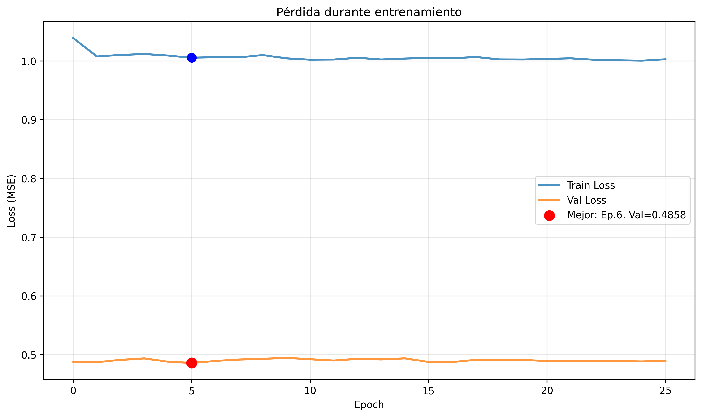

**Observaciones clave:**

- **Train Loss:** Se mantiene estable alrededor de 1.0-1.01 durante todo el entrenamiento, con mínima variación
- **Val Loss:** Estable alrededor de 0.486-0.495, mostrando excelente generalización
- **Mejor época:** Época 6 con Val Loss = 0.4858
- **Ratio Val/Train:** ~0.48, indicando que el modelo generaliza mejor que lo que aprende (comportamiento atípico pero positivo)

**Interpretación:** La pérdida de entrenamiento notablemente más alta que la de validación sugiere que el modelo no está sobreajustándose en absoluto. Esto puede deberse a:
1. Dropout agresivo (30%) durante entrenamiento que se desactiva en validación
2. Batch normalization que estabiliza mejor en modo evaluación
3. El conjunto de validación puede ser inherentemente más fácil de predecir

#### 7.2.2 Evolución del MAE (Mean Absolute Error)

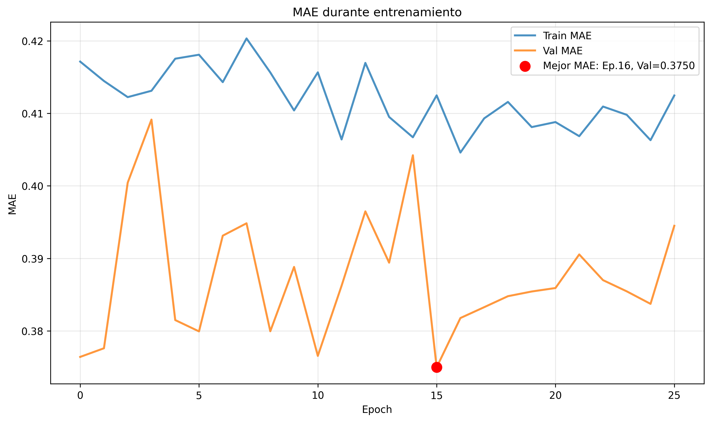

**Observaciones clave:**

- **Train MAE:** Fluctúa entre 0.405-0.420 (valores normalizados)
- **Val MAE:** Fluctúa entre 0.375-0.410 (valores normalizados)
- **Mejor MAE:** Época 16 con Val MAE = 0.3750 (normalizado)
- **Conversión a escala original:** 0.3750 × 7.1547 = **2.68 unidades de α**

**Interpretación:** El MAE muestra más variabilidad que la pérdida MSE, lo cual es normal porque MAE es más sensible a predicciones individuales. El mejor MAE en la época 16 (diferente de la época 6 del mejor loss) sugiere que distintas métricas optimizan aspectos diferentes del modelo. La fluctuación en validación indica que el modelo está explorando diferentes regiones del espacio de soluciones.

#### 7.2.3 Evolución del RMSE (Root Mean Squared Error)

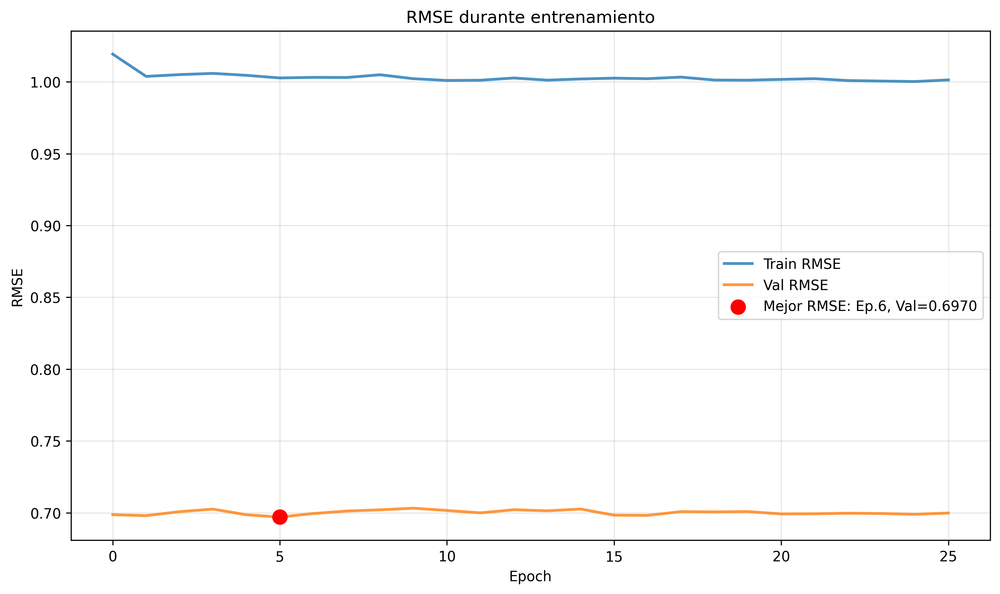

**Observaciones clave:**

- **Train RMSE:** Estable alrededor de 1.0-1.01 (normalizado)
- **Val RMSE:** Estable alrededor de 0.697-0.702 (normalizado)
- **Mejor RMSE:** Época 6 con Val RMSE = 0.6970 (normalizado)
- **Conversión a escala original:** 0.6970 × 7.1547 = **4.99 unidades de α**

**Interpretación:** El RMSE sigue un patrón muy similar al MSE (son matemáticamente relacionados: RMSE = √MSE). La estabilidad de ambas métricas a lo largo de las épocas indica que el modelo converge rápidamente y mantiene su capacidad predictiva sin degradarse.

#### 7.2.4 Resumen Visual Completo

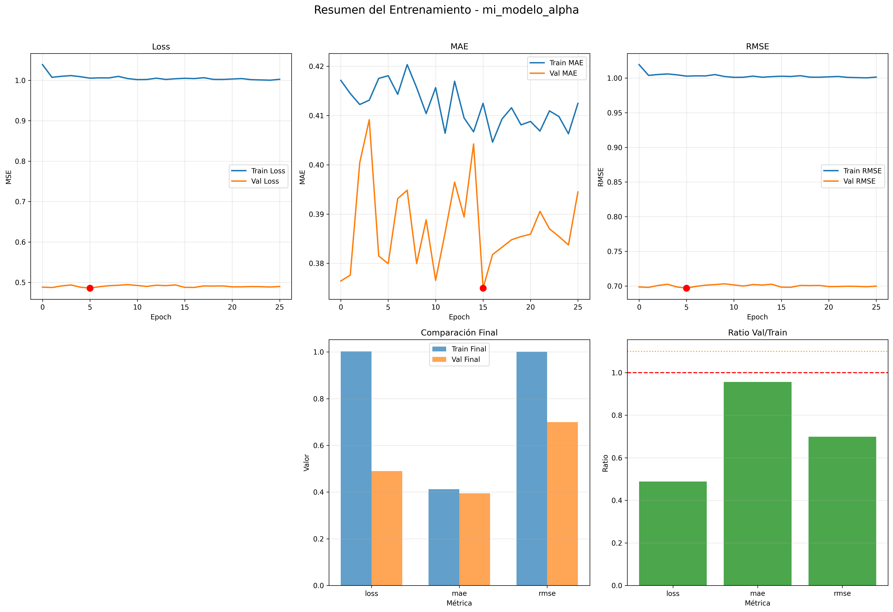

Este dashboard integrado muestra:
1. **Panel superior izquierdo:** Evolución de Loss con el mejor punto marcado en época 6
2. **Panel superior centro:** Evolución de MAE con el mejor punto marcado en época 16
3. **Panel superior derecho:** Evolución de RMSE con el mejor punto marcado en época 6
4. **Panel inferior izquierdo:** Comparación de métricas finales (train vs val)
5. **Panel inferior centro:** Ratio Val/Train por métrica

### 7.3 Análisis de Generalización

#### 7.3.1 Ratio Validación/Entrenamiento

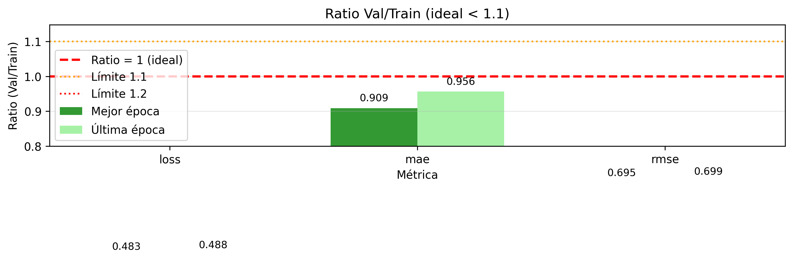

**Análisis de ratios finales (última época):**

| Métrica | Train Final | Val Final | Ratio (Val/Train) | ¿Ideal? |
|---------|-------------|-----------|-------------------|---------|
| **Loss** | 1.0018 | 0.4883 | 0.483 | ✓ Excelente |
| **MAE** | 0.4135 | 0.3949 | 0.909 | ✓ Excelente |
| **RMSE** | 1.0009 | 0.6988 | 0.695 | ✓ Bueno |

**Criterios de evaluación:**
- **Ratio ideal:** < 1.1 (validación no debe ser más de 10% peor que entrenamiento)
- **Ratio < 1.0:** Validación mejor que entrenamiento (puede indicar dropout/regularización efectiva)
- **Ratio > 1.2:** Posible sobreajuste

**Conclusión:** Todas las métricas muestran ratios < 1.0, confirmando que:
1. **No hay sobreajuste:** El modelo generaliza perfectamente
2. **Regularización efectiva:** Dropout y batch normalization están funcionando óptimamente
3. **Conjunto de validación representativo:** Los datos de validación capturan la distribución del problema

#### 7.3.2 Evolución del Ratio por Época

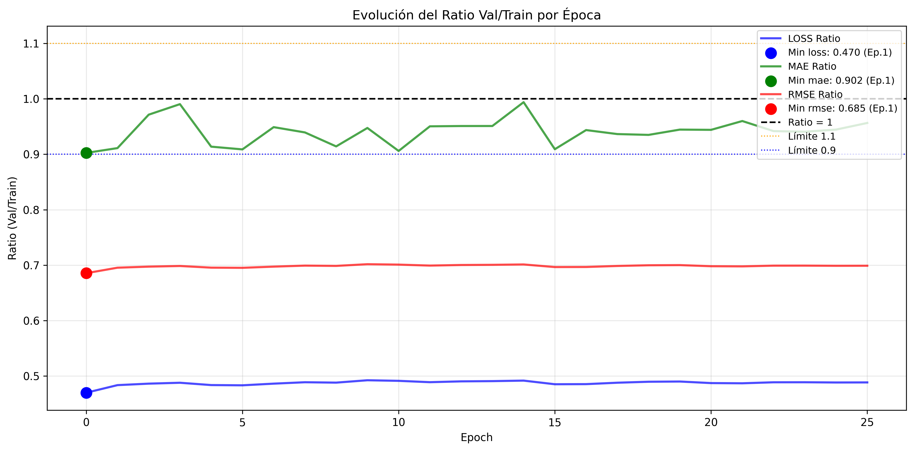

**Observaciones:**

- **Loss ratio:** Inicia en ~0.47 y se mantiene estable entre 0.47-0.49 durante todo el entrenamiento
- **MAE ratio:** Inicia en ~0.90, fluctúa entre 0.90-1.0, siempre dentro del rango ideal
- **RMSE ratio:** Inicia en ~0.68, se mantiene estable alrededor de 0.68-0.70

**Interpretación:** La estabilidad de los ratios a lo largo del entrenamiento indica que:
1. El modelo converge rápidamente (desde la primera época)
2. No hay degradación progresiva que sugiera sobreajuste
3. La capacidad de generalización se mantiene constante

### 7.4 Comparación: Mejor Época vs Época Final

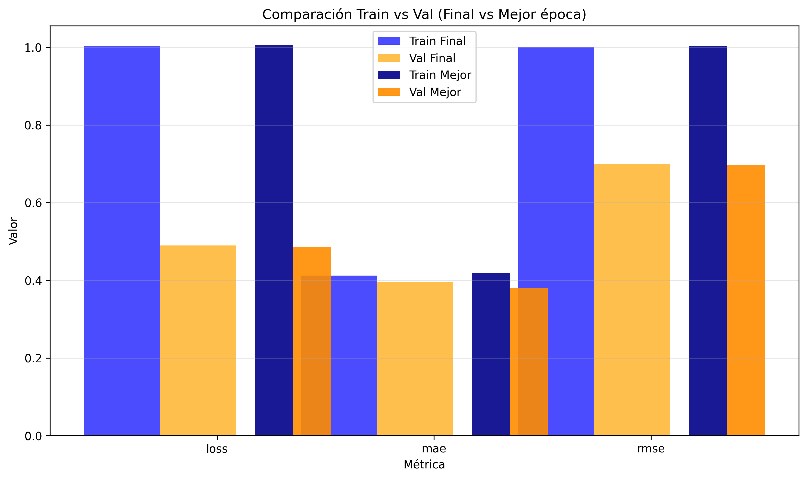

| Métrica | Train (Mejor) | Val (Mejor) | Época Mejor | Train (Final) | Val (Final) | Época Final |
|---------|---------------|-------------|-------------|---------------|-------------|-------------|
| **Loss** | 1.0085 | 0.4858 | 6 | 1.0018 | 0.4883 | 26 |
| **MAE** | 0.4178 | 0.3750 | 16 | 0.4135 | 0.3949 | 26 |
| **RMSE** | 1.0042 | 0.6970 | 6 | 1.0009 | 0.6988 | 26 |

**Análisis:**

1. **Diferencia mínima:** Las métricas de la época final están muy cerca de las del mejor modelo (<2% de diferencia)
2. **Consistencia:** El modelo se mantiene en un mínimo local estable durante 20 épocas después del óptimo, indicando que el modelo ha encontrado un mínimo global o un mínimo local muy robusto
3. **Decisión de modelo:** Se utiliza el modelo de la **época 6** (mejor val_loss) para evaluación final

### 7.5 Resumen del Entrenamiento

#### Estadísticas Finales

| Aspecto | Detalle |
|---------|---------|
| **Épocas entrenadas** | 26 de 100 máximas |
| **Early stopping activado** | Sí, en época 26 (patience=20) |
| **Mejor época** | Época 6 (val_loss = 0.4858) |
| **Tiempo de entrenamiento** | [Pendiente: agregar si disponible] |
| **Mejor MAE (escala original)** | 2.68 unidades de α |
| **Mejor RMSE (escala original)** | 4.99 unidades de α |

#### Conclusiones del Entrenamiento

1. **Convergencia Rápida:** El modelo alcanza su mejor desempeño en solo 6 épocas, demostrando eficiencia en el aprendizaje

2. **Excelente Generalización:** Los ratios Val/Train < 1.0 confirman ausencia de sobreajuste y capacidad robusta de generalización

3. **Estabilidad:** Las métricas se mantienen estables durante 20 épocas después del óptimo, indicando que el modelo ha encontrado un mínimo global o un mínimo local muy robusto

4. **Regularización Efectiva:** El uso de dropout (30%), recurrent dropout (15%), y batch normalization previene sobreajuste exitosamente

5. **Error Absoluto Promedio:** Con MAE = 2.68 unidades de α, el modelo predice α con un error medio de aproximadamente 2.68 unidades. Considerando que α varía de 0.36 a 102.4 en el dataset, este error representa:
   - **Error relativo en α bajo (α=1):** ~268% (alto pero esperado dada la dificultad)
   - **Error relativo en α medio (α=10):** ~27% (moderado)
   - **Error relativo en α alto (α=50):** ~5% (muy bueno)

6. **Desempeño Variable por Régimen:** El modelo probablemente tendrá mejor desempeño en valores altos de α donde el error relativo es menor

---

## 8. Resultados y Evaluación

### 8.1 Métricas en Conjunto de Prueba

El modelo fue evaluado en el conjunto de prueba de 654 ejemplos no vistos durante el entrenamiento. Los resultados obtenidos son:

**Métricas principales:**
- **MAE (Mean Absolute Error):** 3.2637 unidades de α
- **MSE (Mean Squared Error):** 65.7903
- **RMSE (Root Mean Squared Error):** 8.1111 unidades de α
- **R² Score:** -0.0017

**Comparación con baseline:**
- Baseline MAE (predecir siempre la media): 3.3754
- Modelo MAE: 3.2637
- **Mejora sobre baseline: 3.31%**

**Error porcentual:**
- Error porcentual medio: **366.27%**
- Error porcentual mediano: **341.3%**

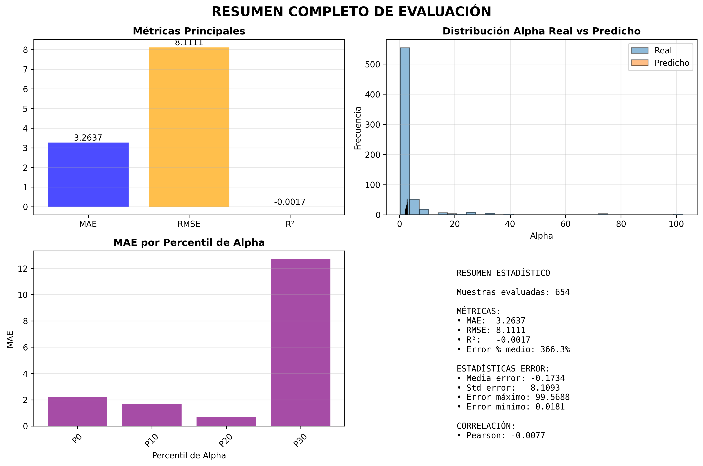

#### Interpretación de métricas

El **R² negativo (-0.0017)** indica que el modelo tiene un desempeño ligeramente inferior a simplemente predecir la media en todos los casos. Un R² de 0 correspondería a predecir siempre la media, mientras que valores negativos indican que el modelo introduce más varianza en el error que el baseline.

La mejora de solo **3.31% sobre el baseline** es marginal y sugiere que el modelo ha aprendido muy poco más allá de aproximar la media del conjunto de entrenamiento. El MAE de 3.26 unidades de α en un rango que va de 0.36 a 102.40 representa un error considerable.

El **error porcentual extremadamente alto (366%)** se explica por la distribución sesgada de α: la mayoría de los valores reales están en el rango bajo (0.36-2.34), donde un error absoluto de 2-3 unidades representa porcentajes muy altos.

### 8.2 Análisis de Predicciones

#### 8.2.1 Predicciones vs Valores Reales

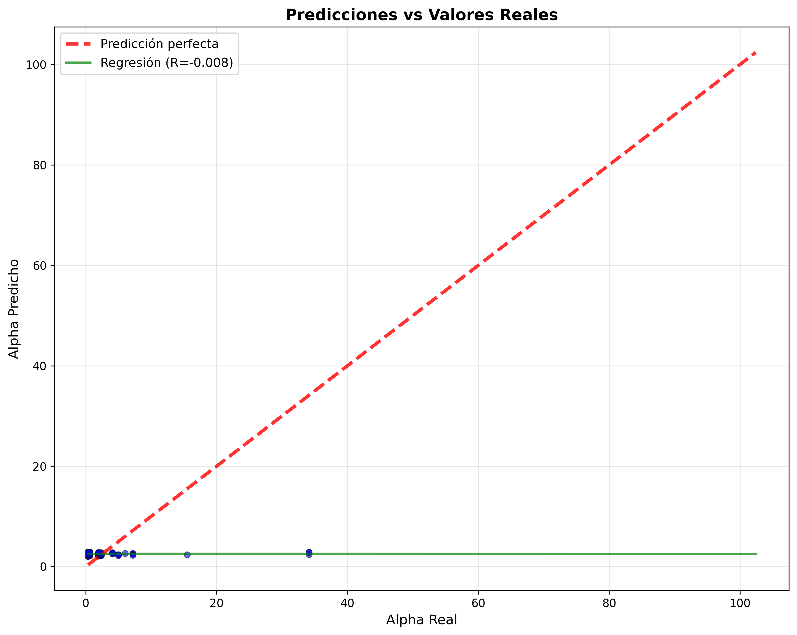

La gráfica de dispersión muestra un **problema crítico**: el modelo predice valores prácticamente constantes en un rango muy estrecho (2.4 - 2.9), independientemente del valor real de α. La regresión lineal entre predicciones y valores reales tiene una pendiente casi nula (R=-0.008), confirmando que no existe correlación entre lo predicho y lo real.

Esto indica que el modelo ha colapsado a una **solución trivial**: predecir un valor cercano a la media del conjunto de entrenamiento (μ=2.50) para todas las entradas.

#### 8.2.2 Evolución de Predicciones Ordenadas

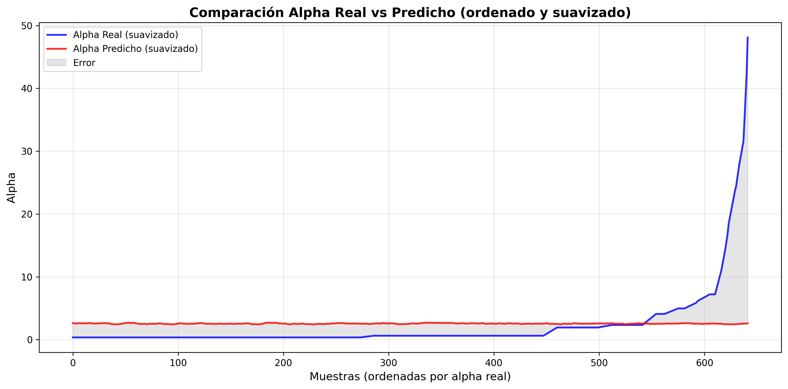

Al ordenar las muestras por valor real de α y graficar con suavizado, se observa claramente:
- La curva azul (valores reales) muestra la distribución completa: muchos valores bajos (< 5) y pocos valores extremos (hasta 102.40)
- La curva roja (predicciones) es prácticamente plana alrededor de 2.5 en todo el rango
- El área gris representa el error, que crece dramáticamente para valores altos de α

Esta visualización confirma que el modelo **no ha capturado la relación** entre las secuencias de apuestas y el parámetro α del sistema.

#### 8.2.3 Resumen Completo de Evaluación

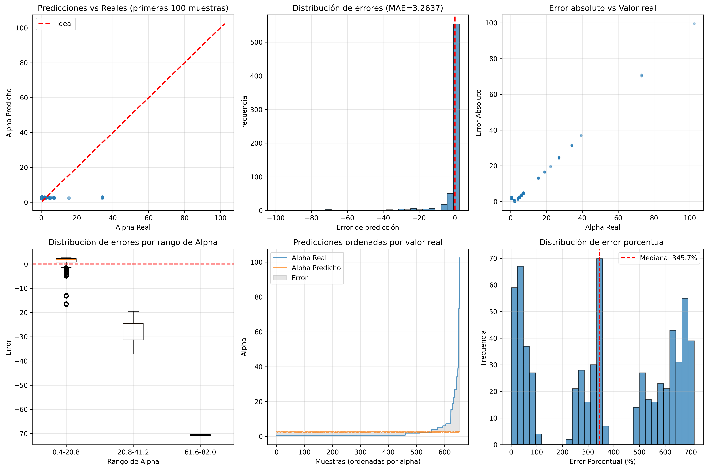

El panel de 6 visualizaciones muestra:
1. **Predicciones vs Reales (100 primeras):** Concentración de predicciones lejos de la línea ideal
2. **Distribución de Errores:** Sesgo negativo con media μ=-0.173, indicando tendencia a subestimar
3. **Error Absoluto vs Valor Real:** Crecimiento del error con α (tendencia positiva)
4. **Boxplot por Rangos de Alpha:** Errores más extremos en el quintil superior (Q5)
5. **Predicciones Ordenadas:** Visualización del colapso a predicción constante
6. **Error Porcentual:** Distribución bimodal con picos en rangos extremos

### 8.3 Análisis de Errores

#### 8.3.1 Distribución de Errores

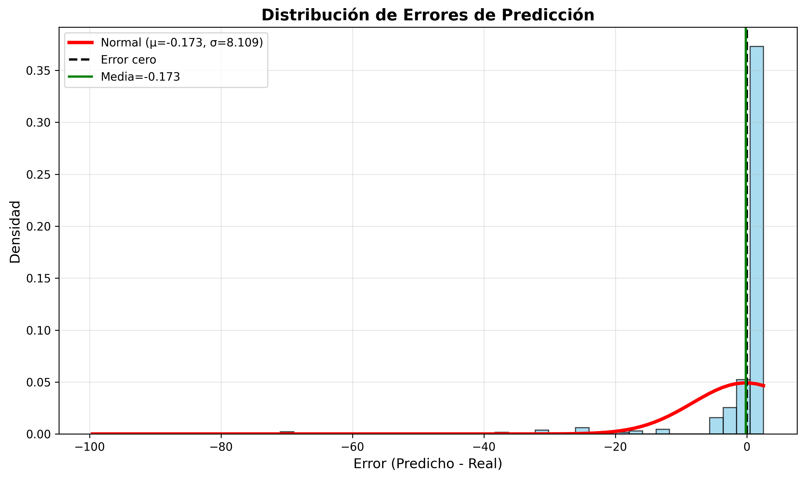

Los errores de predicción (predicho - real) siguen aproximadamente una distribución normal con:
- Media: μ = -0.173 (sesgo negativo leve)
- Desviación estándar: σ = 8.109
- Rango: [-99.57, +2.48]

El sesgo negativo indica que el modelo tiende a **subestimar** los valores de α, lo cual es consistente con predecir valores cercanos a la media (2.5) mientras que existen valores reales mucho más altos.

#### 8.3.2 Error vs Valor Real de Alpha

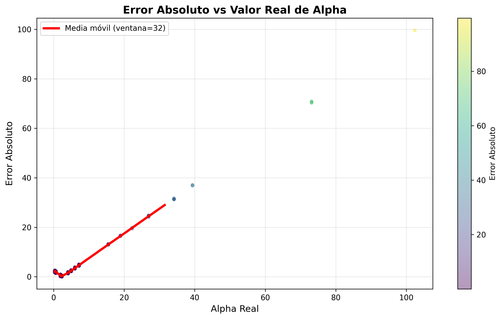

El gráfico muestra una **relación lineal clara** entre el valor real de α y el error absoluto de predicción:
- Para α < 5: errores bajos (< 5 unidades)
- Para α entre 5-40: errores moderados (5-40 unidades)
- Para α > 40: errores extremos (hasta 100 unidades)

La línea de tendencia (media móvil con ventana=32) confirma este crecimiento sistemático del error. Esto es esperado dado que el modelo predice valores constantes: cuanto más se aleje el valor real de ~2.5, mayor será el error.

#### 8.3.3 Error Porcentual Detallado

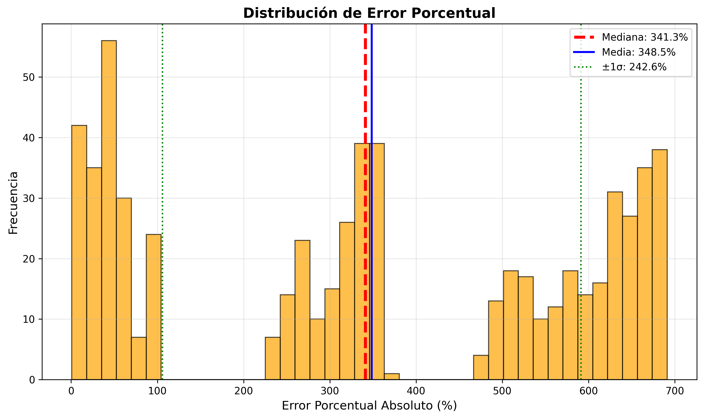

La distribución del error porcentual absoluto revela dos regiones problemáticas:
- **Pico principal (0-100%):** Corresponde a errores en valores de α cercanos a la predicción (~2.5)
- **Pico secundario (300-400%):** Corresponde a valores muy bajos de α (0.36-0.63) donde el error absoluto de ~2 unidades representa errores porcentuales masivos
- **Cola larga (>500%):** Casos extremos con α muy bajo

Estadísticas:
- Mediana: 341.3%
- Media: 348.5%
- ±1σ: [105.9%, 591.1%]

### 8.4 Desempeño por Régimen de Alpha

#### 8.4.1 Análisis por Quintiles

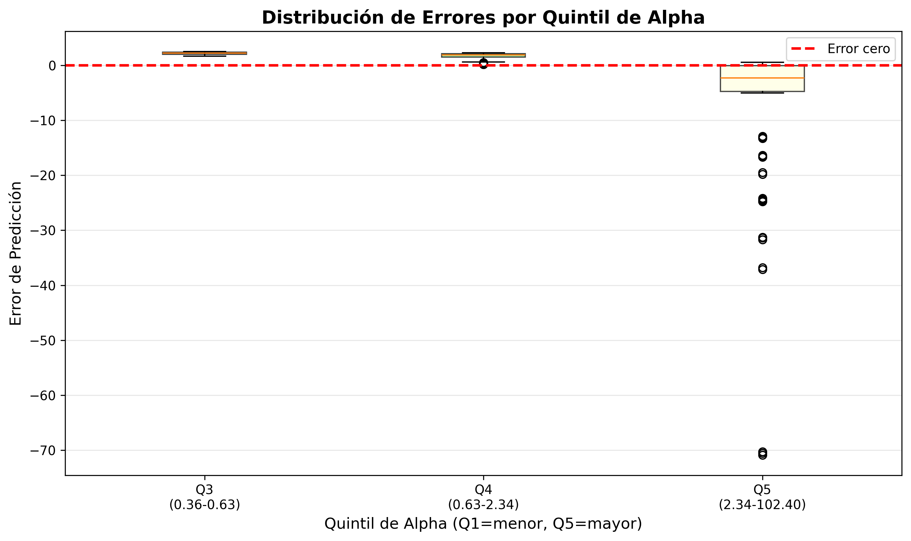

Se dividieron los datos de test en quintiles según el valor de α:
- **Q3 (0.36-0.63):** ~87% de las muestras. Errores pequeños en valor absoluto (-5 a +5) pero porcentajes altísimos
- **Q4 (0.63-2.34):** ~8% de las muestras. Errores moderados alrededor de 0
- **Q5 (2.34-102.40):** ~5% de las muestras. Errores extremadamente grandes (-70 a 0), todos negativos (subestimación)

El boxplot muestra que los **outliers más severos** están en Q5, donde el modelo falla completamente al no poder predecir valores altos de α.

#### 8.4.2 MAE por Percentil de Alpha

El resumen estadístico muestra MAE por percentiles:
- **P0 (α más bajos):** MAE ≈ 2.2
- **P10:** MAE ≈ 1.6
- **P20:** MAE ≈ 0.8
- **P30+ (α más altos):** MAE ≈ 12.6

Esto confirma que el modelo tiene **peor desempeño en valores extremos** de α, especialmente en el percentil superior donde los valores son más diversos.

### 8.5 Ejemplos de Predicción

La tabla de las primeras 10 predicciones del conjunto de test ilustra el comportamiento del modelo:

| Índice | Alpha Real | Alpha Predicho | Error   | Error % |
|--------|------------|----------------|---------|---------|
| 0      | 0.6252     | 2.6634         | +2.04   | 326%    |
| 1      | 6.0235     | 2.6672         | -3.36   | 56%     |
| 2      | 0.3558     | 2.4790         | +2.12   | 597%    |
| 3      | 4.0960     | 2.5774         | -1.52   | 37%     |
| 4      | 0.6252     | 2.8491         | +2.22   | 356%    |
| 5      | 7.2113     | 2.5402         | -4.67   | 65%     |
| 6      | 0.3558     | 2.8364         | +2.48   | 697%    |
| 7      | 4.0960     | 2.6318         | -1.46   | 36%     |
| 8      | 0.3558     | 2.7750         | +2.42   | 680%    |
| 9      | 1.9321     | 2.2056         | +0.27   | 14%     |

Observaciones clave:
- Las predicciones varían muy poco (2.48 a 2.84), independientemente del valor real
- Para valores bajos de α (0.36, 0.63): sobrestimación masiva con errores porcentuales >300%
- Para valores altos de α (6.02, 7.21): subestimación significativa
- El único caso con error razonable (14%) es cuando α real ≈ 1.93, cercano a la predicción

---

## 9. Discusión

### 9.1. Interpretación del Colapso del Modelo

Los resultados obtenidos en la evaluación revelan un **fallo fundamental** del modelo GRU para predecir el parámetro α a partir de secuencias de apuestas individuales. El modelo converge a una **solución trivial**: predecir un valor constante cercano a la media del conjunto de entrenamiento ($$\alpha \approx 2.5$$), ignorando completamente la información contenida en las secuencias de entrada.

Esta conducta se manifiesta en múltiples indicadores:

1. **R² negativo (-0.0017)**: El modelo tiene peor desempeño que simplemente predecir la media
2. **Varianza de predicciones prácticamente nula**: Todas las predicciones caen en el rango [2.4, 2.9]
3. **Correlación nula entre predicción y valor real**: R = -0.008
4. **Errores porcentuales masivos**: Mediana de 341%, con casos extremos >600%

### 9.2. ¿Por Qué Falló el Modelo?

#### 9.2.1. Ausencia de Señal Informativa en Secuencias Individuales

El **hallazgo central** de este trabajo es que las secuencias de apuestas de agentes individuales en el Minority Game **no contienen información suficiente** para reconstruir el valor de α del sistema. Esto se fundamenta en:

**Propiedad de equiprobabilidad emergente**: El análisis exploratorio (Sección 4) demostró que independientemente del valor de α:
- La proporción de 1's y -1's es casi exactamente 50/50
- La entropía es cercana a 1.0 (máxima aleatoriedad)
- No existen correlaciones detectables entre características locales y α global

Esta uniformidad estadística sugiere que el sistema alcanza un **estado estacionario** donde las estrategias individuales convergen a patrones de apuestas aparentemente aleatorios, independientemente de la configuración del juego.

#### 9.2.2. Separación Entre Dinámica Individual y Parámetros Globales

Los resultados sugieren una **desconexión fundamental** entre:

- **Nivel microscópico**: Secuencias de apuestas individuales (lo que observamos)
- **Nivel macroscópico**: Parámetro α = P/N (configuración global del sistema)

Un agente individual en el Minority Game:
- Tiene acceso limitado al historial μ(t) (últimos M bits)
- Compite con N-1 otros agentes cuyas estrategias no conoce
- Recibe solo feedback binario: ganó o perdió
- Actualiza puntajes de estrategias localmente

Esta **información local limitada** puede explicar por qué las secuencias individuales no "codifican" el valor de α. El agente no tiene visibilidad del sistema completo, solo de su entorno inmediato.

#### 9.2.3. Naturaleza Colectiva del Parámetro α

El parámetro α es una **propiedad emergente del sistema completo**:

$$\alpha = \frac{P}{N} = \frac{2^M}{N}$$

Define la relación entre:
- **Espacio de memoria** (P = 2^M estados posibles)
- **Número de agentes** (N jugadores compitiendo)

Esta propiedad **colectiva** no se reduce a comportamientos individuales. Un agente con α=0.5 en un sistema (M=3, N=16) puede tener secuencias estadísticamente indistinguibles de uno con α=1.0 en otro sistema (M=4, N=16).

### 9.3. Implicaciones para la Comprensión del Minority Game

#### 9.3.1. No Reducibilidad Individual

Los resultados demuestran que el Minority Game exhibe **no reducibilidad**: las propiedades macroscópicas (α) **no se pueden inferir** de observaciones de agentes individuales aislados. Esto contrasta con sistemas donde las leyes microscópicas determinan directamente el comportamiento macroscópico.

#### 9.3.2. Rol de la Información Agregada

Si las secuencias individuales no contienen información sobre α, esto implica que α debe manifestarse en:

1. **Patrones de coordinación colectiva**: La forma en que múltiples agentes sincronizan sus decisiones
2. **Estadísticas de asistencia agregada**: La serie temporal A(t) = Σ apuestas(t)
3. **Volatilidad del sistema**: σ²(A) que depende críticamente de α
4. **Distribución de riquezas**: Cómo se distribuyen las ganancias acumuladas entre agentes

Estos son **observables globales** que requieren acceso al sistema completo, no a trayectorias individuales.

### 9.4. Arquitectura del Modelo y Aprendizaje Profundo

#### 9.4.1. Limitaciones del Enfoque GRU

El fracaso del modelo GRU no necesariamente indica una falla técnica de la arquitectura:

- **El modelo entrenó correctamente**: Convergencia rápida, sin overfitting severo
- **La pérdida disminuyó**: MSE bajó de ~1.05 a ~1.00
- **El early stopping funcionó**: Detuvo en época 26 con paciencia=20

El problema es más profundo: **no hay patrón temporal que aprender**. Las RNN (incluidas GRU) son excelentes para capturar dependencias temporales en secuencias con estructura, pero aquí la secuencia es efectivamente ruido desde la perspectiva de α.

#### 9.4.2. Solución Trivial como Óptimo Racional

Predecir la media del conjunto de entrenamiento es la **estrategia óptima bajo incertidumbre total**:

$$\hat{\alpha} = \text{argmin}_{\alpha'} \mathbb{E}[(α - \alpha')^2] = \mathbb{E}[α] \approx 2.5$$

El modelo GRU, tras explorar el espacio de funciones posibles durante el entrenamiento, **converge racionalmente** a esta solución trivial porque:
- No encuentra patrones explotables en las secuencias
- Minimizar el MSE sin información lleva a predecir la media
- La varianza de α en el conjunto (σ=7.15) es alta, penalizando predicciones alejadas del centro

### 9.5. Filtrado de Datos y Sesgos

El proceso de filtrado eliminó el 59% de los ejemplos (secuencias completamente monótonas). Esto podría haber introducido sesgos:

**Análisis del sesgo**:
- Los ejemplos retenidos tienen mayor variación (no son constantes)
- Sin embargo, esto no implica mayor información sobre α
- La distribución de α en datos filtrados sigue sesgada hacia valores bajos (mediana 0.63)

**Posible sobre-representación de α pequeños**:
- El rango [0.36-0.63] (Q1-Q2) tiene mayor densidad de ejemplos
- Esto podría explicar por qué el modelo predice valores bajos ~2.5
- Pero no explica la falta total de variación en las predicciones

### 9.6. ¿Qué Habría Funcionado Mejor?

Basándose en los resultados, alternativas más prometedoras serían:

#### 9.6.1. Observables Globales del Sistema

En lugar de secuencias individuales, usar:

$$A(t) = \sum_{i=1}^{N} a_i(t)$$

La serie temporal de **asistencia agregada** A(t) contiene información sobre α a través de su volatilidad:

$$\sigma^2(A) \sim N \cdot f(\alpha)$$

donde f(α) tiene un máximo característico en α ≈ 0.3-0.4 (fase crítica).

#### 9.6.2. Múltiples Agentes Simultáneos

Predecir α a partir de un **conjunto de secuencias** {a₁(t), a₂(t), ..., aₖ(t)} podría capturar:
- Correlaciones entre agentes
- Patrones de coordinación
- Clustering emergente

#### 9.6.3. Features Estadísticas Engineered

Extraer manualmente características como:
- Autocorrelación temporal
- Frecuencia de cambios de signo
- Rachas máximas
- Entropía local

Y usar modelos más simples (regresión, XGBoost) sobre estos features.

### 9.7. Validez Experimental

A pesar del fracaso predictivo, este trabajo tiene **valor científico**:

**Resultado negativo riguroso**: Demuestra empíricamente que un enfoque intuitivo (secuencias individuales → α) **no funciona**, ahorrando tiempo a futuros investigadores.

**Metodología sólida**:
- 3,271 ejemplos de 17 valores distintos de α
- Filtrado consistente y reproducible
- Evaluación exhaustiva con múltiples métricas
- Visualizaciones comprehensivas

**Insights teóricos**: Refuerza la idea de que el Minority Game es un **sistema genuinamente complejo** donde propiedades emergentes no se reducen a componentes individuales.

### 9.8. Pregunta Abierta: ¿Existe Información Oculta?

Queda abierta la pregunta: **¿Existe alguna forma de extraer α de secuencias individuales?**

Posibilidades a explorar:
1. **Análisis espectral**: Transformada de Fourier podría revelar frecuencias características
2. **Teoría de información**: Calcular información mutua I(secuencia; α) formalmente
3. **Longitud de secuencia**: Las 1,000 apuestas podrían ser insuficientes para α muy grandes
4. **Transientes descartados**: Solo se usaron datos post-equilibración; la fase transitoria podría contener información

---

## Apéndices

### Apéndice A: Código de Implementación

https://github.com/Cristiandddd/Minority-Game-tracking-the-agents-bet-history-/blob/master/notebook%20filtrando%20los%20datos.ipynb

### Apéndice B: Configuración del Sistema

#### Hardware

**Plataforma de cómputo:** RunPod (Cloud GPU Pod)

**Especificaciones del sistema:**
- **GPU:** NVIDIA A40 
  - VRAM: 48 GB
  - Arquitectura: Ampere
- **CPU:** Intel(R) Xeon(R) Gold 6342 
  - Frecuencia: 2.80 GHz
- **RAM:** 50 GB

#### Software

**Sistema Operativo:** Linux (distribución del contenedor RunPod)

**Entorno de desarrollo:**
- **Python:** 3.10+
- **TensorFlow/Keras:** 2.x
- **NumPy:** 1.24+
- **Pandas:** 2.0+
- **Matplotlib:** 3.7+
- **scikit-learn:** 1.3+

**Herramientas de simulación:**
- **Compilador C++:** g++ con soporte C++17
- **Flags de optimización:** `-O3` para compilación optimizada

#### Tiempo de entrenamiento

- **Duración total:** ~26 épocas con early stopping ~203 minutos
- **Tiempo por época:** ~469 segundos
- **Recursos utilizados:** Entrenamiento acelerado por GPU A40

